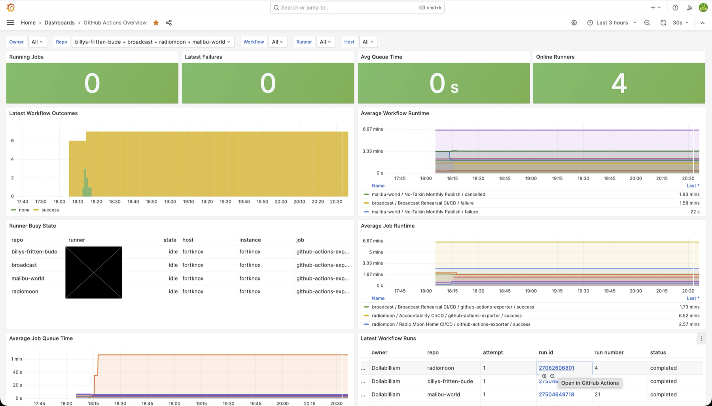

# GitHub Actions Self-Hosted Runner Exporter

Prometheus exporter for GitHub Actions pipelines that run on self-hosted
runners.

The goal is operational visibility for a small runner fleet:

- Is a pipeline running right now?
- How have the last builds been?
- What is the average pipeline and job runtime?
- Are jobs waiting on runner capacity?
- Which runner handled the work?
- Where are the useful runner-side logs?

This exporter polls the GitHub Actions REST API for canonical workflow, job,
and runner state. Runner diagnostic logs should be shipped separately to Loki
from each self-hosted runner host.

## Example Grafana Dashboard



An importable Grafana dashboard is included at
[`examples/grafana/dashboards/github-actions-overview.json`](examples/grafana/dashboards/github-actions-overview.json).
It covers active jobs, latest workflow outcomes, runtime and queue averages,
runner state, and an optional Loki runner-log panel.

See [docs/grafana.md](docs/grafana.md) for import/provisioning notes and
[docs/metrics.md](docs/metrics.md) for the metric contract behind the panels.

## Quick Start

```bash
cp config.example.json .config.local.json
export GITHUB_TOKEN=<github-token>
make run
```

The local `.config.local.json` file is ignored by git so you can put your real
repository list there without publishing it. Then open:

```text
http://127.0.0.1:9176/metrics
http://127.0.0.1:9176/healthz
```

Or check the health endpoint from another shell:

```bash
make healthz
```

## GitHub Token

Use a token that can read Actions metadata for the repositories you configure.
For private repositories, this generally means repository Actions read access.
The exporter does not need write access. Fine-grained token permissions vary by
repository and runner scope, so start with the least-privileged token that can
read workflow runs, workflow jobs, and self-hosted runner metadata.

## Docker

The published image is available from GitHub Container Registry:

```bash
docker run --rm \
  -p 9176:9176 \
  -e GITHUB_TOKEN \
  -v "$PWD/config.json:/etc/github-actions-exporter/config.json:ro" \
  ghcr.io/dollabilliam/github-actions-self-hosted-runner-exporter:main \
  -config /etc/github-actions-exporter/config.json
```

## Configuration

Configuration is JSON to keep the first implementation dependency-light:

```json
{
  "github": {
    "token_env": "GITHUB_TOKEN"
  },
  "server": {
    "listen_address": ":9176"
  },
  "scrape": {
    "refresh_interval": "60s",
    "runs_per_repository": 20
  },
  "repositories": [
    { "owner": "example-org", "name": "repo-1" },
    { "owner": "example-org", "name": "repo-2" },
    { "owner": "example-org", "name": "repo-3" }
  ]
}
```

## Alloy Integration Shape

The intended deployment is a container on the same network as your metrics
collector. Grafana Alloy can scrape the exporter and remote-write metrics to
Prometheus. Runner `_diag` logs can be shipped from each runner host to Loki by
Alloy or another log collector.

```yaml
monitoring_alloy_extra_prometheus_scrapes:
  - component: github_actions_exporter
    address: github-actions-exporter:9176
    job: github-actions-exporter
    instance_label: runner-host-1
```

## Security Notes

Keep the exporter endpoint internal. Metrics can reveal repository names,
workflow names, runner names, build status, queue time, and runtime information.
See [SECURITY.md](SECURITY.md) for more operational guidance.
